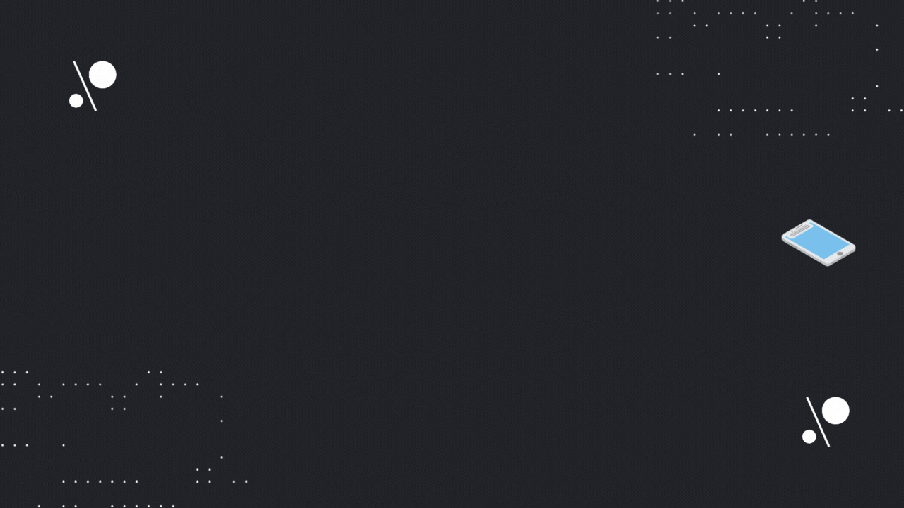

# Hi there 👋, I'm Nazmul Hossain
## _I'm Web & Mobile App Developer._

Hello! I’m Nazmul Hossain. I am a student by profession but I spend my days learning programming languages and new concepts. I love coding and right now I am more focused on JavaScript, React JS, <b> React Native</b>, etc.

 

<!-- ------------------------------ -->
<!-- ---- My social links start --- -->
<!-- ------------------------------ -->
## :coffee: _Connect with me!_

 
 
 

  
 

<!-- ------------------------------ -->
<!-- ----- My social links end ---- -->
<!-- ------------------------------ -->

<!-- -------------------------------- -->
<!-- -------- My skils start -------- -->
<!-- -------------------------------- -->
## _My skills!_

 
 

<!--
 
 

 

 
 
-->
<!--  -->

<!--   -->
<!--   -->
<!--   -->
<!--   -->
<!--   -->
<!--   -->
<!--   -->
<!--   -->
<!--   -->
<!--   -->
<!--  -->

<!-- ------------------------------ -->
<!-- -------- My skils end -------- -->
<!-- ------------------------------ -->

<!-- ------------------------------------ -->
<!-- GitHub contribution grid snake start -->
<!-- ------------------------------------ -->

<!-- ---------------------------------- -->
<!-- GitHub contribution grid snake end -->
<!-- ---------------------------------- -->

   <table align="center">
       <tr>
       <td align="center" width="50%"></td>
       <td align="center" width="50%"> </td>
     </tr>
     <tr>
        <td colspan="2" align="center"></td>
     </tr>
   </table>

<!-- 

   

 -->

 

