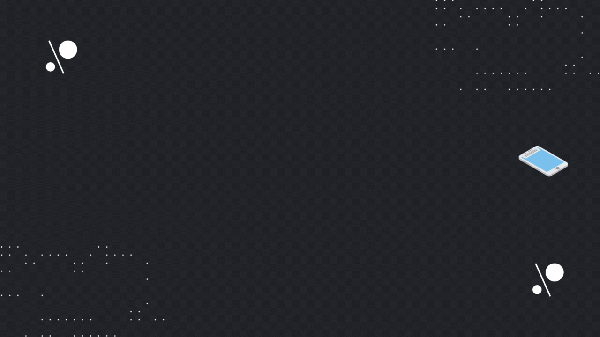

    

<h1 align="center">Hi there 👋, I'm Nazmul Hossain</h1>
<h3 align="center">React Native | Frontend Developer | JavaScript | TypeScript</h3>

## ⚡️ Discover in a second

<table border="0" width="100%">
    <tr>
        <td width="65%">
            <ul>
               <li>I love coding 💘.</li>
               <li>I spend my days learning programming languages and new concepts.</li>
               <li>Right now I am more focused on JavaScript, React JS, React Native.</li>
            </ul>
        </td>
        <td width="35%" align="right">
        
        </td>
    </tr>
</table>

## 🔗 **Get in Touch**

  

## 🛠️ **Skills**

### Programming Languages

<!--  -->
<!--  -->

### Frontend Development

<!--  -->
<!--  -->
<!--  -->
<!--  -->
<!--  -->
<!--  -->

<!--  -->

<!--  -->
<!--  -->

<!--
### Back-End Development

 -->

### Mobile App Development

<!--  -->

### Design Tools

<!--  -->

<!-- ## 🖥️ **Workspace Setup**

 -->

## 🎯 **Contributes**

<!-- ------------------------------------ -->
<!-- GitHub contribution grid snake start -->
<!-- ------------------------------------ -->

<!-- ---------------------------------- -->
<!-- GitHub contribution grid snake end -->
<!-- ---------------------------------- -->

## 📈 **Stats**

    
      
      
    <table align="center">
      <tr>
         <td align="center" width="50%"></td>
         <td align="center" width="50%">
         
      </td>
   </tr>
      <tr>
         <td colspan="2" align="center">
         
         </td>
      </tr>
   </table>

