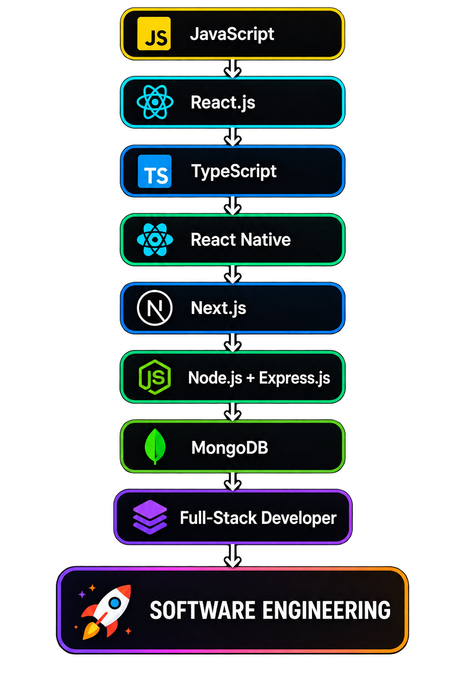

<a name="top"></a>

[](https://www.facebook.com/NazmulHossain2905)
[](https://www.instagram.com/nazmulh2905/)
[](https://x.com/NazmulH2905)
[](mailto:nazmulhossain2905@gmail.com)
[](https://www.linkedin.com/in/nazmulhossain2905/)
[](https://www.github.com/NazmulHossain2905)

# 👋 Hi, I'm Nazmul Hossain

[](https://git.io/typing-svg)

<!-- ### Full-Stack JavaScript Developer · React & React Native Developer · TypeScript Enthusiast -->

I'm a passionate **Full-Stack JavaScript Developer** from Bangladesh 🇧🇩 who enjoys turning ideas into modern, responsive, and user-focused applications.

I work primarily with the **JavaScript/TypeScript ecosystem**, building applications across the frontend, backend, and mobile platforms. I enjoy solving real-world problems, designing reusable components, and writing clean, maintainable code.

I'm currently focused on strengthening my skills in **React.js, Next.js, Node.js, Express.js, TypeScript, and MongoDB**, while continuing to explore software architecture, backend engineering, and scalable application development.

> 🚀 **Build. Break. Learn. Improve. Repeat.**


---

## 🧑‍💻 About Me

- 👨‍💻 **Full-Stack JavaScript Developer** passionate about building real-world applications
- ⚛️ Building modern web applications with **React.js & Next.js**
- 📱 Building cross-platform mobile applications with **React Native**
- 🟦 Using **TypeScript** to write safer and more maintainable code
- 🎨 Creating responsive and accessible interfaces with **Tailwind CSS**
- 🔧 Building backend services and REST APIs with **Node.js & Express.js**
- 🗄️ Working with **MongoDB & Mongoose**
- 🧩 Interested in reusable components, clean architecture, and scalable project structures
- 🧠 Continuously improving **problem-solving and software engineering fundamentals**
- 📚 Learning through hands-on projects and real-world development

```ts
(function everyday(alive: boolean): string | undefined {
  if (!alive) return "😢";

  prayer();
  eat();
  sleep();
  code();

  everyday(alive);
})(alive);
```

<!--  -->

---

## 🛠️ **Tech Stack**



### 💻 Programming Languages

<p>
  
</p>

### 🎨 Front-End Development

<p>
  
</p>

### 📱 Cross-Platform Development

<p>
  
</p>

**React Native · React Native CLI · Android**

### 🔧 Back-End Development

<p>
  
</p>

**Node.js · Express.js · REST APIs**

### 🗄️ Database

<p>
  
</p>

**MongoDB · Mongoose**

### ⚙️ Tools & Workflow

<p>
  
</p>

### 🎨 Design Tools

<p>
  
</p>

## 🖥️ **Workspace Setup**


## 🚀 **Featured Projects**

Here are some of the projects I'm building and experimenting with while developing my skills.

<table>
<tr>
<td width="50%" valign="top">

<a href="https://github.com/NazmulHossain2905/react-logo-maker">

</a>

### 🎨 React Logo Maker

🎨 A simple and customizable logo maker built with **React.js** and **Tailwind CSS**.

`React.js` `JavaScript` `Tailwind CSS` `Vite`

[🔗 View Project](https://github.com/NazmulHossain2905/react-logo-maker) · [🚀 Live Demo](https://loogoomaker.vercel.app/)

</td>

<td width="50%" valign="top">

<a href="https://github.com/NazmulHossain2905/statistics-mathematics">
   
</a>

### 📊 Statistics Mathematics

📐 A simple web-based tool for solving statistics mathematics problems.

`HTML` `CSS` `JavaScript`

[🔗 View Project](https://github.com/NazmulHossain2905/statistics-mathematics) · [🚀 Live Demo](https://nazmulhossain2905.github.io/statistics-mathematics/)

</td>
</tr>

<tr>
<td width="50%" valign="top">

<a href="https://github.com/NazmulHossain2905/weather-app">

</a>

### 🌤️ Weather App

🌦️ A responsive weather application built with **Vanilla JavaScript** that fetches real-time weather data.

`HTML` `CSS` `JavaScript` `OpenWeatherMap API`

[🔗 View Project](https://github.com/NazmulHossain2905/weather-app) · [🚀 Live Demo](https://nazmulhossain2905.github.io/weather-app/)

</td>

<td width="50%" valign="top">

<a href="https://github.com/NazmulHossain2905/react-password-generator">

</a>

### 🔐 React Password Generator

🔑 A simple React-based password generator for creating random passwords quickly and easily.

`React.js` `JavaScript` `Vite` `React DOM`

[🔗 View Project](https://github.com/NazmulHossain2905/react-password-generator) · [🚀 Live Demo](https://a-password-generator.vercel.app/)

</td>
</tr>
</table>

> 💡 More projects, experiments, and open-source work are coming soon.

---

<!-- <div width="100%" align="center">
   
</div> -->

## 🌱 Currently Learning

I'm currently focusing on becoming a stronger **full-stack software engineer** rather than simply learning more technologies.

### 🎯 Current Focus

- 🟦 Advanced **JavaScript & TypeScript**
- ⚛️ Advanced **React.js**
- ▲ **Next.js & modern web architecture**
- 🔧 **Node.js & Express.js**
- 🗄️ **MongoDB & database design**
- 🔐 Authentication & authorization
- 🔌 REST API design and backend architecture
- 🧩 Clean code & reusable architecture
- 🏗️ Scalable application architecture
- 🧠 Data structures & problem solving
- 📐 Software engineering fundamentals

> **My goal isn't to collect technologies — it's to understand how to build better software.**

---

## 🧠 Development Philosophy

I believe good software isn't just about making something work.

It's about making it:

**Readable → Maintainable → Reusable → Reliable → Scalable**

I try to approach every project with a focus on:

- Clean and understandable code
- Meaningful naming and project structure
- Reusable components
- Separation of concerns
- Performance and user experience
- Practical and scalable solutions
- Continuous improvement

---

## 📈 My Development Journey

```text
                 ╭───────────────╮
                 │  JavaScript   │
                 ╰───────┬───────╯
                         │
                 ╭───────▼──────╮
                 │   React.js   │
                 ╰───────┬──────╯
                         │
                  ╭──────▼───────╮
                  │  TypeScript  │
                  ╰──────┬───────╯
                         │
                 ╭───────▼────────╮
                 │  React Native  │
                 ╰───────┬────────╯
                         │
                 ╭───────▼──────╮
                 │    Next.js   │
                 ╰───────┬──────╯
                         │
          ╭──────────────▼──────────────╮
          │    Node.js + Express.js     │
          ╰──────────────┬──────────────╯
                         │
                  ╭──────▼───────╮
                  │    MongoDB   │
                  ╰──────┬───────╯
                         │
            ╭────────────▼─────────────╮
            │   Full-Stack Developer   │
            ╰────────────┬─────────────╯
                         │
              ╭──────────▼───────────╮
              │ SOFTWARE ENGINEERING │
              ╰──────────────────────╯
```

I'm continuously moving deeper into the stack — from **building interfaces** to understanding the **systems behind them**.

## 🐍 **GitHub Contribution Snake**

<!-- ------------------------------------ -->
<!-- GitHub contribution grid snake start -->
<!-- ------------------------------------ -->
<p align="center">
   
</p>
<!-- ---------------------------------- -->
<!-- GitHub contribution grid snake end -->
<!-- ---------------------------------- -->

### 📊 **GitHub Stats**

### 📋 Profile Summary

<p align="center">
  
</p>

### 🔤 Top Languages

<p align="center">
  
  
</p>

### 📈 GitHub Statistics

<p align="center">
  
  &nbsp;&nbsp;&nbsp;&nbsp;
  
</p>

### 🔥 Contribution Streak

<p align="center">
  
  &nbsp;&nbsp;&nbsp;&nbsp;
  
</p>

<!-- ## 🚀 **Featured Projects**

<a href="https://github.com/yourusername/project">
  
</a>

### 🛒 React Logo Maker — Icon-Based Logo Creator

🎨 A simple and customizable logo maker built with React.js and Tailwind CSS. Choose an icon, customize its background and border, and create your own logo with ease.

`React.js` `JavaScript` `Tailwind CSS` `Vite`

[🔗 View Project](https://github.com/NazmulHossain2905/react-logo-maker) · [🚀 Live Demo](https://loogoomaker.vercel.app/)

---

<a href="https://github.com/NazmulHossain2905/statistics-mathematics">
  
</a>

### 📊 Statistics Mathematics — Statistics Problem Solver

📐 A simple web-based tool for solving statistics mathematics problems, built with **JavaScript**, **HTML**, and **CSS**.

`HTML` `CSS` `JavaScript`

[🔗 View Project](https://github.com/NazmulHossain2905/statistics-mathematics) · [🚀 Live Demo](https://nazmulhossain2905.github.io/statistics-mathematics/)

---

<a href="https://github.com/NazmulHossain2905/weather-app">
  
</a>

### 🌤️ Weather App — Real-Time Weather Dashboard

🌦️ A responsive weather application built with **Vanilla JavaScript** that fetches real-time weather data and displays temperature, location, conditions, humidity, wind, pressure, and visibility.

`HTML` `CSS` `JavaScript` `OpenWeatherMap API`

[🔗 View Project](https://github.com/NazmulHossain2905/weather-app) · [🚀 Live Demo](https://nazmulhossain2905.github.io/weather-app/)

---

<a href="https://github.com/NazmulHossain2905/react-password-generator">
  
</a>

### 🔐 React Password Generator — Secure Password Generator

🔑 A simple React-based password generator for creating random passwords quickly and easily.

`React.js` `JavaScript` `Vite` `React DOM`

[🔗 View Project](https://github.com/NazmulHossain2905/react-password-generator) · [🚀 Live Demo](https://a-password-generator.vercel.app/)

--- -->

<!--
### 🚀 Projects

| Project          | Description                     | Tech                     |
| ---------------- | ------------------------------- | ------------------------ |
| 🛒 **Shop App**  | E-commerce mobile application   | React Native, JavaScript |
| 💬 **Chat App**  | Real-time messaging application | React, Node.js           |
| 🎵 **Music App** | Music discovery and player UI   | React Native             |

🔗 [View all projects](https://github.com/yourusername?tab=repositories) -->

## 🤝 **Connect with Me**

I'm always interested in connecting with developers, learning from others, discussing technology, and collaborating on interesting projects.

[](https://www.facebook.com/NazmulHossain2905)
[](https://www.instagram.com/nazmulh2905/)
[](https://www.twitter.com/NazmulH2905)
[](mailto:nazmulhossain2905@gmail.com)
[](https://www.linkedin.com/in/nazmulhossain2905/)
[](https://www.github.com/NazmulHossain2905)

---


## 💬 Let's Build Something

Whether you're interested in **web development, mobile development, JavaScript, TypeScript, React, backend engineering, or open-source**, feel free to connect.

<p align="center">
  <b>Thanks for visiting my profile! ❤️</b>
</p>

<p align="center">
  <i>Keep learning. Keep building. Keep improving. 🚀</i>
</p>

<br/>
<p align="center">
  <a href="#top">Go to top 🔝</a>
</p>

<div align="center">


</div>
