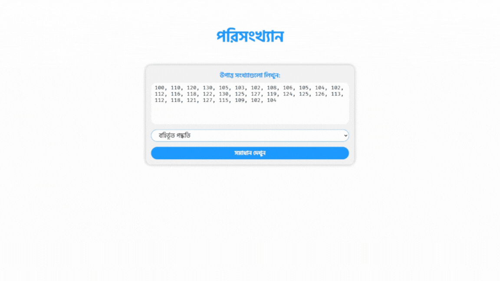
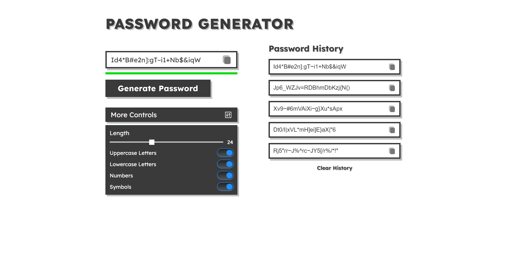

<a name="top"></a>


# Welcome to [Nazmul's](https://github.com/NazmulHossain2905) profile! 

[](https://git.io/typing-svg)


## 👨‍💻 About Me

```ts
(function everyday(alive: boolean): string | undefined {
  if (!alive) return "😢";

  prayer();
  eat();
  sleep();
  code();

  everyday(alive);
})(alive);
```

## ⚡️ Discover in a second

- 💘 I love turning ideas into code.
- 🧠 Always learning new languages, tools, and concepts.
- ⚡ Currently focused on **JavaScript, React, and React Native**.
- 🚀 Building, experimenting, and getting better every day.


## 🛠️ **Skills**

### Programming Languages


<!--


-->

### Front-End Development


<!--  -->
<!--  -->
<!--  -->
<!--  -->
<!--  -->
<!--  -->

### Back-End Development


### Cross-Platform Development


<!--  -->

### Design Tools


## 🖥️ **Workspace Setup**


## 🚀 **Featured Projects**

<table>
<tr>
<td width="50%" valign="top">

<a href="https://github.com/NazmulHossain2905/react-logo-maker">

</a>

### 🛒 React Logo Maker

🎨 A simple and customizable logo maker built with **React.js** and **Tailwind CSS**.

`React.js` `JavaScript` `Tailwind CSS` `Vite`

[🔗 View Project](https://github.com/NazmulHossain2905/react-logo-maker) · [🚀 Live Demo](https://loogoomaker.vercel.app/)

</td>

<td width="50%" valign="top">

<a href="https://github.com/NazmulHossain2905/statistics-mathematics">
   
</a>

### 📊 Statistics Mathematics

📐 A simple web-based tool for solving statistics mathematics problems.

`HTML` `CSS` `JavaScript`

[🔗 View Project](https://github.com/NazmulHossain2905/statistics-mathematics) · [🚀 Live Demo](https://nazmulhossain2905.github.io/statistics-mathematics/)

</td>
</tr>

<tr>
<td width="50%" valign="top">

<a href="https://github.com/NazmulHossain2905/weather-app">

</a>

### 🌤️ Weather App

🌦️ A responsive weather application built with **Vanilla JavaScript** that fetches real-time weather data.

`HTML` `CSS` `JavaScript` `OpenWeatherMap API`

[🔗 View Project](https://github.com/NazmulHossain2905/weather-app) · [🚀 Live Demo](https://nazmulhossain2905.github.io/weather-app/)

</td>

<td width="50%" valign="top">

<a href="https://github.com/NazmulHossain2905/react-password-generator">

</a>

### 🔐 React Password Generator

🔑 A simple React-based password generator for creating random passwords quickly and easily.

`React.js` `JavaScript` `Vite` `React DOM`

[🔗 View Project](https://github.com/NazmulHossain2905/react-password-generator) · [🚀 Live Demo](https://a-password-generator.vercel.app/)

</td>
</tr>
</table>

## 🎯 **Contributes**

<!-- ------------------------------------ -->
<!-- GitHub contribution grid snake start -->
<!-- ------------------------------------ -->

<p align="center">
   
</p>
<!-- ---------------------------------- -->
<!-- GitHub contribution grid snake end -->
<!-- ---------------------------------- -->

## 📊 **GitHub Stats**

<div width="100%" align="center">
    
   
</div>

<!-- ## 🚀 **Featured Projects**

<a href="https://github.com/yourusername/project">
  
</a>

### 🛒 React Logo Maker — Icon-Based Logo Creator

🎨 A simple and customizable logo maker built with React.js and Tailwind CSS. Choose an icon, customize its background and border, and create your own logo with ease.

`React.js` `JavaScript` `Tailwind CSS` `Vite`

[🔗 View Project](https://github.com/NazmulHossain2905/react-logo-maker) · [🚀 Live Demo](https://loogoomaker.vercel.app/)

---

<a href="https://github.com/NazmulHossain2905/statistics-mathematics">
  
</a>

### 📊 Statistics Mathematics — Statistics Problem Solver

📐 A simple web-based tool for solving statistics mathematics problems, built with **JavaScript**, **HTML**, and **CSS**.

`HTML` `CSS` `JavaScript`

[🔗 View Project](https://github.com/NazmulHossain2905/statistics-mathematics) · [🚀 Live Demo](https://nazmulhossain2905.github.io/statistics-mathematics/)

---

<a href="https://github.com/NazmulHossain2905/weather-app">
  
</a>

### 🌤️ Weather App — Real-Time Weather Dashboard

🌦️ A responsive weather application built with **Vanilla JavaScript** that fetches real-time weather data and displays temperature, location, conditions, humidity, wind, pressure, and visibility.

`HTML` `CSS` `JavaScript` `OpenWeatherMap API`

[🔗 View Project](https://github.com/NazmulHossain2905/weather-app) · [🚀 Live Demo](https://nazmulhossain2905.github.io/weather-app/)

---

<a href="https://github.com/NazmulHossain2905/react-password-generator">
  
</a>

### 🔐 React Password Generator — Secure Password Generator

🔑 A simple React-based password generator for creating random passwords quickly and easily.

`React.js` `JavaScript` `Vite` `React DOM`

[🔗 View Project](https://github.com/NazmulHossain2905/react-password-generator) · [🚀 Live Demo](https://a-password-generator.vercel.app/)

--- -->

<!--
### 🚀 Projects

| Project          | Description                     | Tech                     |
| ---------------- | ------------------------------- | ------------------------ |
| 🛒 **Shop App**  | E-commerce mobile application   | React Native, JavaScript |
| 💬 **Chat App**  | Real-time messaging application | React, Node.js           |
| 🎵 **Music App** | Music discovery and player UI   | React Native             |

🔗 [View all projects](https://github.com/yourusername?tab=repositories) -->

## 🤝 **Connect with Me**

[](https://www.facebook.com/NazmulHossain2905)
[](https://www.instagram.com/nazmulh2905/)
[](https://www.twitter.com/NazmulH2905)
[](mailto:nazmulhossain2905@gmail.com)
[](https://www.linkedin.com/in/nazmulhossain2905/)
[](https://www.github.com/NazmulHossain2905)

---

<!-- <div width="100%" align="center">
   
</div> -->

<br/>
<p align="center">
  <a href="#top">Go to top 🔝</a>
</p>
